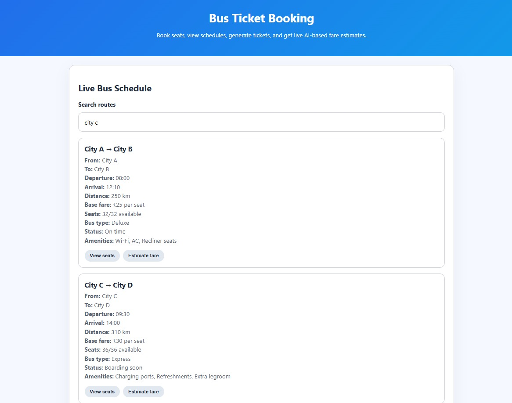
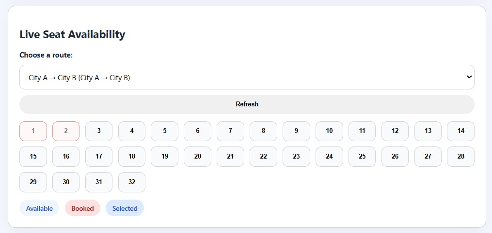
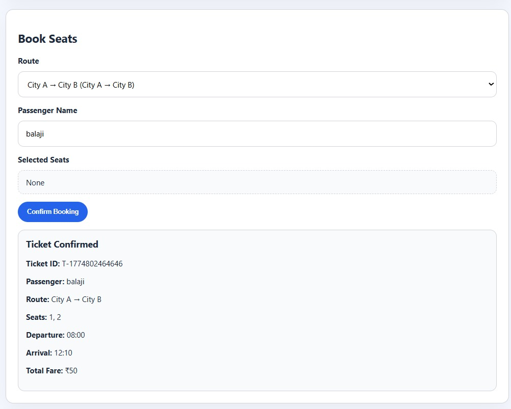
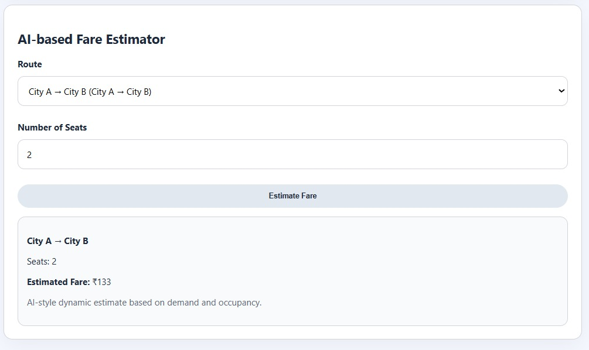

# Bus Ticket Booking App

A simple bus ticket booking web application with:
- seat booking
- live schedule display
- seat availability and seat map
- ticket generation after booking
- AI-based fare estimator

## Run locally

1. Open a terminal in this folder.
2. Install dependencies:
   ```bash
   npm install
   ```
3. Start the server:
   ```bash
   npm start
   ```
4. Open `http://localhost:3000` in your browser.

## Features

- `GET /api/schedule` - list all bus routes and live capacity
- `GET /api/seats?routeId=...` - load seat layout and availability
- `GET /api/fare-estimate?routeId=...&passengerCount=...` - AI-style fare estimate
- `POST /api/book` - book seats and receive ticket details
- **Live Bus Schedule** — Search and browse available bus routes with departure/arrival times, distance, fare, bus type, status, and amenities.
- **Live Seat Availability** — Visual seat map showing available, booked, and selected seats in real time.
- **Book Seats** — Select seats, enter passenger name, and confirm booking to generate a ticket with a unique Ticket ID.
- **AI-based Fare Estimator** — Dynamic fare estimation based on route, number of seats, demand, and occupancy levels.
- **Ticket Confirmation** — Displays Ticket ID, passenger name, route, seats, departure/arrival, and total fare.

# 🚌 Bus Ticket Booking App

> Book seats, view schedules, generate tickets, and get live AI-based fare estimates — all in one place.

---

## 📸 Screenshots

### 🏠 Live Bus Schedule


### 🪑 Live Seat Availability


### 🎟️ Book Seats


### 🤖 AI-based Fare Estimator



## 🗂️ Project Structure

```
BUS-TICKET-APPB/
├── public/
│   ├── app-v3.js       # Main frontend logic (latest version)
│   ├── app.js          # Frontend logic
│   ├── index.html      # Main HTML entry point
│   └── styles.css      # App styling
├── server.js           # Node.js/Express backend server
├── package.json        # Project dependencies
├── package-lock.json   # Dependency lockfile
└── README.md
```
## 🚀 Getting Started

### Prerequisites

- [Node.js](https://nodejs.org/) (v14 or above)
- npm

### Installation

```bash
# Clone the repository
git clone https://github.com/your-username/bus-ticket-appb.git

# Navigate to the project directory
cd bus-ticket-appb

# Install dependencies
npm install
```

### Running the App

```bash
node server.js
```

Then open your browser and go to: `http://localhost:3000`

---

## 🛠️ Tech Stack

| Layer     | Technology          |
|-----------|---------------------|
| Frontend  | HTML, CSS, JavaScript |
| Backend   | Node.js, Express    |
| AI Fare   | Dynamic pricing logic based on demand & occupancy |

---

## 📋 How to Use

1. **View Schedule** — Browse the Live Bus Schedule section to find available routes.
2. **Check Seats** — Select a route to see the live seat map.
3. **Book** — Enter your name, select seats on the seat map, and click **Confirm Booking**.
4. **Estimate Fare** — Use the AI-based Fare Estimator to get a fare estimate before booking.
5. **Ticket** — Your confirmed ticket with all details is displayed instantly.

---

## 🤝 Contributing

Pull requests are welcome! For major changes, please open an issue first to discuss what you'd like to change.

---

## 📄 License

This project is open source and available under the [MIT License](LICENSE).

---

> Made with ❤️ — Bus Ticket Booking App
## Notes

This app uses an in-memory route data model, so bookings reset when the server restarts. It is a good starting point for adding persistence and real backend logic.
